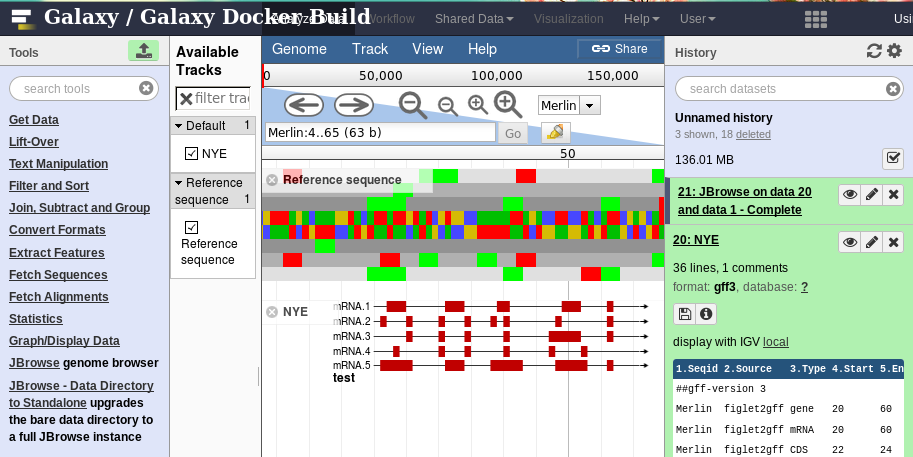

# figlet2gff3

I don't think this ever needed to exist, but now it does. Turn the output of
figlet/toilet into a gff3 file compatible with JBrowse.

## Usage

```console
$ echo '2016!' | figlet | python figlet2gff3.py
```



Okay that's a lie, it isn't quite taht simple. After the first pass through
figlet I usually save to a temporary file, then manually kern the letters a bit
and touch them up for nicer display.

## TODO

- [ ] Configurable landmark (currently hardcoded to 'Merlin' from the test dataset I used)
- [ ] Support the --gay/--metal flags
- [ ] Support the full charset and use opacity for the mapping
- [ ] Add a jp2a2gff3
- [ ] Just paint pixel by pixel
- [ ] City-Skyline2bigwig?

## LICENSE

GPLv3
